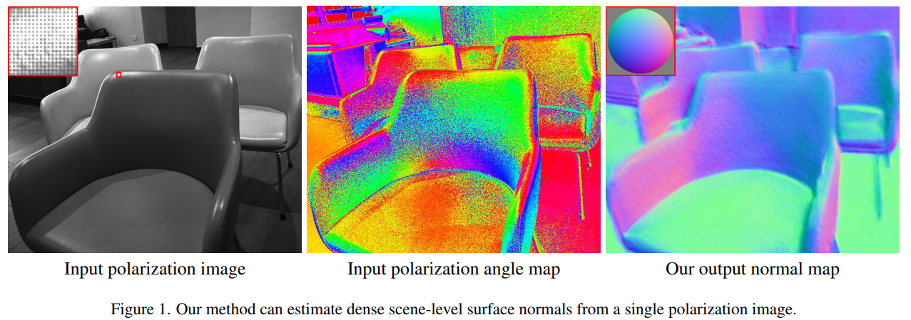

# sfp-wild
Implementation for Shape from Polarization for Complex Scenes in the Wild (CVPR 2022)

[project website](https://chenyanglei.github.io/sfpwild/index.html) | [paper](https://arxiv.org/pdf/2112.11377.pdf)

Code and dataset will be released soon.
## Introduction

We present a new data-driven approach with physics-based priors to scene-level normal estimation from a single polarization image. Existing shape from polarization (SfP) works mainly focus on estimating the normal of a single object rather than complex scenes in the wild. A key barrier to high-quality scene-level SfP is the lack of real-world SfP data in complex scenes. Hence, we contribute the first real-world scene-level SfP dataset with paired input polarization images and ground-truth normal maps. Then we propose a learning-based framework with a multi-head self-attention module and viewing encoding, which is designed to handle increasing polarization ambiguities caused by complex materials and non-orthographic projection in scene-level SfP. Our trained model can be generalized to far-feld outdoor scenes as the relationship between polarized light and surface normals is not affected by distance. Experimental results demonstrate that our approach significantly outperforms existing SfP models on two datasets.

 

## Citation
If you find this work useful for your research, please cite:
```
@article{lei2021shape,
    title={Shape from Polarization for Complex Scenes in the Wild}, 
    author={Chenyang Lei and Chenyang Qi and Jiaxin Xie and Na Fan and Vladlen Koltun and Qifeng Chen},
    year={2021},
    journal={arXiv: 2112.11377},
}
```

## Contact
Please contact us if there is any question (Chenyang Lei, leichenyang7@gmail.com; Chenyang Qi, cqiaa@connect.ust.hk)
